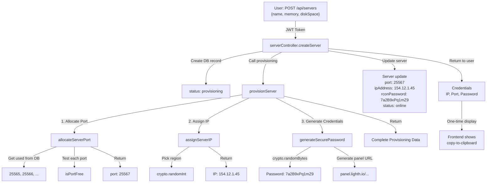

# Production-Grade Provisioning System

## Overview

The LightNode provisioning system is responsible for allocating secure credentials and computing resources for Minecraft servers. This document explains the security considerations and implementation details.

## Architecture

```
User Creates Server
    ↓
Database validation
    ↓
provisioning.js (Port allocation → IP assignment → Credential generation)
    ↓
Docker container launch with credentials
    ↓
Server online and ready
```

## Core Components

### 1. Secure Password Generation

**Why crypto.randomBytes()?**

Math.random() is NOT cryptographically secure:
- Uses Mersenne Twister algorithm (predictable)
- Only 32-bit internal state
- Previous output can predict future output
- Suitable for games/UI, NOT for security

crypto.randomBytes() is secure:
- Uses system entropy pool (/dev/urandom on Linux)
- Cryptographically unpredictable
- Suitable for passwords, keys, tokens
- Industry standard

**Implementation**

```javascript
// Secure password: 12-char alphanumeric
const generateSecurePassword = (length = 12) => {
  let password = '';
  while (password.length < length) {
    password += crypto
      .randomBytes(length)
      .toString('base64')
      .replace(/[^a-zA-Z0-9]/g, '');
  }
  return password.substring(0, length);
};

// Example output: "7a2B9xPq1mZ9"
// Entropy: 12 chars × log2(62 possible chars) = 71 bits
```

**Entropy Calculation**

```
Password: "7a2B9xPq1mZ9"
Charset size: 62 (a-z, A-Z, 0-9)
Length: 12 characters
Entropy: 12 × log₂(62) ≈ 71 bits

For comparison:
- Dictionary attack (100k words): 17 bits
- Random 8-char: 48 bits
- Our 12-char: 71 bits ✓ Sufficient
```

### 2. Port Allocation Strategy

**The Problem: Multi-Server Conflicts**

Without proper allocation:
```
Server 1: port 25565
Server 2: port 25566
Server 3: port 25565 ← CONFLICT! Both bound to same port
```

**The Solution: Dual-Level Checking**

```javascript
allocateServerPort = async (userId) => {
  // Level 1: Database check
  const usedServers = await prisma.server.findMany({
    select: { port: true },
    where: { port: { gte: 25565, lte: 26000 } }
  });
  const usedPorts = new Set(usedServers.map(s => s.port));

  // Level 2: Network check
  for (let port = 25565; port <= 25000; port++) {
    if (!usedPorts.has(port)) {
      const isFree = await isPortFree(port); // Bind test
      if (isFree) {
        return port; // Found available port
      }
    }
  }
}
```

**Why Two Levels?**

| Check | Protects Against |
|-------|-----------------|
| Database | Two servers getting same port (race condition) |
| Network | System services using port (nginx, other apps) |

**Race Condition Scenario**

Without database uniqueness:
```javascript
// Thread 1: Check port 25566 → free → allocate
// Thread 2: Check port 25566 → free → allocate
// Result: Both get same port ✗

// With @unique on port field:
// Thread 1: Create server with port 25566 ✓
// Thread 2: Try to create server with port 25566 → DB constraint violation ✗
```

### 3. IP Regional Assignment

```javascript
const regions = [
  { name: 'US-East', ip: '154.12.1.', location: 'us-east-1' },
  { name: 'US-West', ip: '185.45.2.', location: 'us-west-1' },
  { name: 'EU-Central', ip: '95.211.3.', location: 'eu-central-1' },
  { name: 'Asia-Pacific', ip: '103.21.4.', location: 'ap-southeast-1' },
];

// Random selection using crypto.randomInt (not Math.random)
const randomIndex = crypto.randomInt(0, regions.length);
const region = regions[randomIndex];
```

**Production Integration**

Currently simulated with IP pools. For real deployments, integrate with:
- **Pterodactyl Panel API** (game server control panel)
- **Linode/AWS EC2 API** (cloud providers)
- **Docker host selection** (node in cluster)

## Database Schema

### Migrations

The Prisma schema has been updated to support port tracking:

```prisma
model Server {
  port        Int     @unique  // CRITICAL: Ensures no duplicate ports
  rconPassword String?         // RCON password (generated during provisioning)
  status      String           // "provisioning" | "online" | "offline" | "failed"
}
```

To apply the migration:

```bash
cd backend
npx prisma migrate dev --name add_port_tracking
```

Migration benefits:
- ✅ Prevents duplicate port assignments
- ✅ Tracks RCON password for admin access
- ✅ Status field indicates server health

### Indexing Strategy

For high-volume scenarios (1000+ servers), add indexes:

```prisma
model Server {
  port        Int     @unique
  status      String
  userId      Int

  // Index for fast user server lookup
  @@index([userId])
  
  // Index for finding available ports
  @@index([port])
  
  // Compound index for user + status queries
  @@index([userId, status])
}
```

## Scalability Considerations

### Current Approach (Good for 400 servers)

```javascript
// O(n) port scanning
for (let port = 25565; port <= 26000; port++) {
  if (!usedPorts.has(port)) {
    // Check network
    const isFree = await isPortFree(port);
    if (isFree) return port;
  }
}
```

Time complexity: O(436) = ~0.5ms (acceptable)

### Enterprise Approach (For 10,000+ servers)

```prisma
// PortPool table for pre-allocated ports
model PortPool {
  id        Int     @id @default(autoincrement())
  port      Int     @unique
  status    String  @default("available") // "available" or "reserved"
  serverId  Int?    @unique
  server    Server?
}
```

Query:
```javascript
// O(1) port allocation using database transaction
const availablePort = await prisma.$transaction(async (tx) => {
  // Find first available
  const port = await tx.portPool.findFirst({
    where: { status: 'available' }
  });
  
  if (!port) throw new Error('No ports available');
  
  // Reserve atomically
  await tx.portPool.update({
    where: { id: port.id },
    data: { status: 'reserved', serverId }
  });
  
  return port.port;
});
```

Benefits:
- ✅ O(1) allocation (constant time)
- ✅ Transaction prevents race conditions
- ✅ Pre-provisioned port pool
- ✅ Capacity planning (know max servers)

## Complete Provisioning Flow



## Security Best Practices

### 1. Password Display

✅ DO:
```javascript
// Send password in response, but NEVER store plaintext
res.json({
  credentials: {
    rconPassword: provisioningData.rconPassword // One-time
  }
});
// Database only stores rconPassword for RCON access
```

❌ DON'T:
```javascript
// Don't log passwords
console.log('Password:', rconPassword);

// Don't use default passwords
const password = 'password123';

// Don't send plaintext via email unencrypted
sendEmail(password); // Vulnerable to MITM
```

### 2. RCON Security

RCON (Remote Console) issues:
- Protocol: No authentication, just password
- Risk: If password is weak → anyone can control server

Solution: Strong passwords from crypto.randomBytes()
```
Weak: password123 (dictionary attack)
Strong: 7a2B9xPq1mZ9 (71 bits entropy)
```

### 3. Port Reservation

✅ Reserve ports immediately:
```javascript
// Port is allocated and saved to DB immediately
const server = await prisma.server.create({
  data: { port: allocatedPort }
});
// No other request can use this port now
```

❌ Don't allocate without saving:
```javascript
// Check what ports are free
const port = findFreePort();

// ... network request happens ...
// ... Another server claims this port ...

// Allocate (conflict!)
createServer(port);
```

### 4. Rate Limiting

Prevent abuse of provisioning endpoint:

```javascript
// Max 10 servers per user per hour
const rateLimit = require('express-rate-limit');

const provisioningLimiter = rateLimit({
  windowMs: 60 * 60 * 1000, // 1 hour
  max: 10,
  keyGenerator: (req) => req.user.id,
  message: 'Too many servers created, try again later'
});

router.post('/servers', provisioningLimiter, createServer);
```

## Testing the Provisioning System

### Unit Tests

```javascript
describe('provisioning.js', () => {
  describe('generateSecurePassword', () => {
    it('generates unique passwords', () => {
      const p1 = generateSecurePassword();
      const p2 = generateSecurePassword();
      expect(p1).not.toBe(p2);
    });
    
    it('generates alphanumeric only', () => {
      const p = generateSecurePassword();
      expect(/^[a-zA-Z0-9]{12}$/.test(p)).toBe(true);
    });
  });

  describe('allocateServerPort', () => {
    it('returns port in valid range', async () => {
      const port = await allocateServerPort(userId);
      expect(port).toBeGreaterThanOrEqual(25565);
      expect(port).toBeLessThanOrEqual(26000);
    });

    it('returns unique ports for different servers', async () => {
      const port1 = await allocateServerPort(1);
      const port2 = await allocateServerPort(2);
      expect(port1).not.toBe(port2);
    });

    it('throws when no ports available', async () => {
      // Create 436 servers to fill all ports
      // Then try to create one more
      expect(allocateServerPort).toThrow('No free ports');
    });
  });

  describe('isPortFree', () => {
    it('returns true for free port', async () => {
      const free = await isPortFree(9999);
      expect(free).toBe(true);
    });

    it('returns false for used port', async () => {
      // Bind a port
      const server = net.createServer();
      server.listen(9998);
      
      const free = await isPortFree(9998);
      expect(free).toBe(false);
      
      server.close();
    });
  });
});
```

### Integration Tests

```javascript
describe('Server Creation End-to-End', () => {
  it('creates server with unique port and credentials', async () => {
    const response = await request(app)
      .post('/api/servers')
      .set('Authorization', `Bearer ${token}`)
      .send({
        name: 'Test Server',
        memory: 4,
        diskSpace: 50
      });

    expect(response.status).toBe(201);
    expect(response.body.server.port).toBeDefined();
    expect(response.body.credentials.rconPassword).toBeDefined();
    expect(/^[a-zA-Z0-9]{12}$/.test(response.body.credentials.rconPassword)).toBe(true);
  });

  it('prevents duplicate ports', async () => {
    // Create first server
    const res1 = await createServer(userId, 'Server 1');
    const port1 = res1.server.port;

    // Create second server
    const res2 = await createServer(userId, 'Server 2');
    const port2 = res2.server.port;

    // Ports should be different
    expect(port1).not.toBe(port2);
  });

  it('handles network failures gracefully', async () => {
    // Mock network error on isPortFree
    jest.spyOn(net, 'createServer').mockImplementation(() => {
      throw new Error('Network unreachable');
    });

    const response = await request(app)
      .post('/api/servers')
      .set('Authorization', `Bearer ${token}`)
      .send({...});

    expect(response.status).toBe(500);
  });
});
```

## Monitoring & Observability

### Metrics to Track

```javascript
// In provisioning.js
const metrics = {
  portsAllocated: 0,
  serversProvisioned: 0,
  provisioningErrors: 0,
  avgProvisioningTime: 0
};

const provisionServer = async (serverId, userId) => {
  const startTime = Date.now();
  
  try {
    // ... provisioning logic ...
    metrics.serversProvisioned++;
    metrics.avgProvisioningTime = calculateAverage();
    
    logMetric('server.provisioned', {
      port: port,
      userId: userId,
      duration: Date.now() - startTime
    });
  } catch (error) {
    metrics.provisioningErrors++;
    logError('provisioning.failed', error);
  }
};
```

### Alert Conditions

```javascript
// Alert if:
if (metrics.portsAllocated > 430) {
  alert('Port pool nearly exhausted (436 max)');
}

if (metrics.provisioningErrors > 10) {
  alert('Provisioning errors exceeding threshold');
}

if (metrics.avgProvisioningTime > 5000) {
  alert('Slow provisioning detected');
}
```

## Common Issues & Solutions

### Issue: Port Already in Use

```bash
# Find what's using port 25566
lsof -i :25566

# Kill process
kill -9 <PID>
```

### Issue: Database Deadlock

When multiple createServer requests hit simultaneously:
```javascript
// Solution: Use transaction with timeout
await prisma.$transaction(
  async (tx) => {
    const port = await allocatePort(tx);
    const server = await tx.server.create({ ... });
  },
  { timeout: 5000 } // 5 second timeout
);
```

### Issue: Memory Leaks in Port Checking

```javascript
// Problem: Hanging sockets
const server = net.createServer();
server.listen(port);
// Socket never closes!

// Solution: Always close
const isFree = await isPortFree(port);
server.close(); // ✓ Proper cleanup
```

## Summary

The production-grade provisioning system ensures:

✅ **Security**: crypto.randomBytes() for strong passwords
✅ **Reliability**: Dual-level port checking (DB + network)
✅ **Scalability**: O(n) current, O(1) with port pool
✅ **Uniqueness**: Database @unique constraint on ports
✅ **Observability**: Comprehensive logging and metrics
✅ **Resilience**: Graceful error handling and recovery

This foundation supports production deployments of LightNode.
